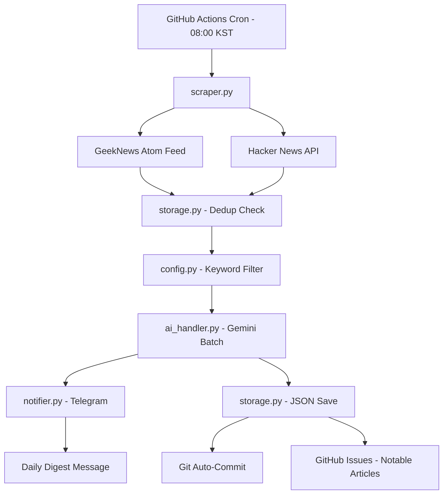

# InsightFlow - AI 기술 트래킹 앱

> GitHub Actions 기반 서버리스 AI 기술 뉴스 트래커

## 📋 프로젝트 소개

InsightFlow는 개발자를 위한 AI 기술 뉴스 자동 수집 및 요약 서비스입니다. 매일 오전 8시에 GeekNews와 Hacker News에서 기사를 수집하고, Gemini AI로 핵심 내용을 요약하여 텔레그램으로 전송합니다.

## 🏗️ 시스템 아키텍처



## 🔄 데이터 흐름

1. **매일 오전 8시** GitHub Actions 자동 실행
2. **GeekNews Atom 피드** + **HN API**에서 기사 수집
3. **중복 체크** (`seen_ids.json` 기반)
4. **키워드 필터링** → **Gemini AI 요약** + 관련성 점수
5. **텔레그램**으로 다이제스트 발송
6. **JSON 파일** 저장 + Git 자동 커밋
7. **고관련성 기사**는 GitHub Issues에 기록

## 📦 모듈 구성

| 모듈 | 역할 |
|------|------|
| `config.py` | 설정값 및 환경변수 관리 |
| `scraper.py` | GeekNews Atom 피드 + HN API 데이터 수집 |
| `ai_handler.py` | Gemini 2.0 Flash 배치 요약 + 관련성 점수 |
| `storage.py` | JSON 저장 + 중복 방지 + GitHub Issues 생성 |
| `notifier.py` | 텔레그램 메시지 포매팅 + 청킹 + 발송 |
| `main.py` | 메인 오케스트레이터 (`--dry-run` 지원) |

## 🚀 로컬 개발 환경 설정

### 1. 레포지토리 클론
```bash
git clone <your-repo-url>
cd InsightFlow
```

### 2. Python 가상환경 생성
```bash
python3.11 -m venv venv
source venv/bin/activate  # Windows: venv\Scripts\activate
```

### 3. 의존성 설치
```bash
pip install -r requirements.txt
```

### 4. 환경변수 설정
```bash
cp .env.example .env
# .env 파일을 열어 실제 키 값 입력
```

### 5. 로컬 테스트 실행
```bash
python src/main.py --dry-run
```

## ⚙️ GitHub Actions 설정

### 1. GitHub Secrets 설정

`Settings > Secrets and variables > Actions`에서 다음 값 추가:

- `GEMINI_API_KEY` - Google AI Studio API 키
- `TELEGRAM_BOT_TOKEN` - 텔레그램 봇 토큰
- `TELEGRAM_CHAT_ID` - 텔레그램 채팅 ID

### 2. Actions 활성화

`.github/workflows/daily-digest.yml`이 이미 포함되어 있습니다.

### 3. 수동 실행 테스트

Actions 탭에서 "InsightFlow Daily Digest" 워크플로우를 수동 실행하여 테스트합니다.

## 🤖 텔레그램 봇 설정

### 1. 봇 생성

1. 텔레그램에서 [@BotFather](https://t.me/botfather) 검색
2. `/newbot` 명령어 입력
3. 봇 이름 입력 (예: `InsightFlow Bot`)
4. 봇 사용자명 입력 (예: `insightflow_yourname_bot`)
5. **토큰**을 복사하여 `TELEGRAM_BOT_TOKEN`에 저장

### 2. Chat ID 확인

브라우저에서 다음 URL 접속:
```
https://api.telegram.org/bot<YOUR_BOT_TOKEN>/getUpdates
```

`chat.id` 값을 복사하여 `TELEGRAM_CHAT_ID`에 저장

## 🔑 Gemini API 키 발급

1. [Google AI Studio](https://aistudio.google.com/) 방문
2. "Get API Key" 클릭
3. 새 API 키 생성
4. **gemini-2.0-flash** 모델 사용 (묣 티어: RPM 15, RPD 1,500)

## 🔔 실패 알림 메커니즘

- **GitHub Actions 자체 이메일 알림** (기본 제공)
- **텔레그램 실패 알림**: 파이프라인 실패 시 자동 발송
  - 실패 원인 포함
  - Actions 실행 URL 포함

## 🛡️ 중복 방지 메커니즘

- `data/seen_ids.json`에 처리된 기사 ID 저장
- 키 형식: `"{source}:{source_id}"` (예: `"geeknews:12345"`)
- 매 실행 시 새 기사만 필터링
- Git으로 `seen_ids.json` 버전 관리

## 📝 사용 예시

### 로컬에서 Dry Run 실행
```bash
python src/main.py --dry-run
```

### 환경변수로 Dry Run 설정
```bash
DRY_RUN=true python src/main.py
```

### 특정 소스만 테스트
```python
from src.scraper import fetch_geeknews
articles = fetch_geeknews()
print(f"수집된 기사: {len(articles)}")
```

## ⚠️ 주의사항

- **Gemini 묣 티어 제한**: 하루 1,500회 (배치 처리로 효율적 사용)
- **텔레그램 메시지 제한**: 4,096자 (자동 청킹 지원)
- **GitHub Actions Cron 편차**: ±5-15분 (정확한 8시 보장 불가)

## 📄 라이선스

MIT License
