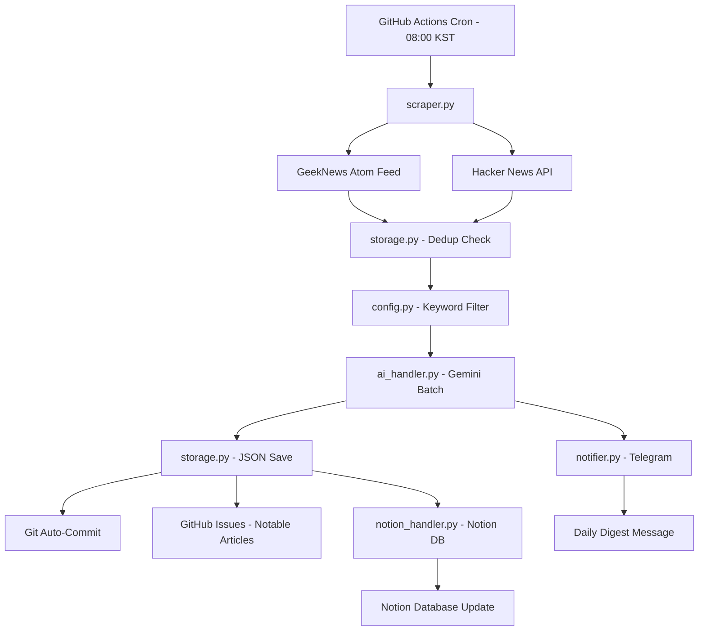

# InsightFlow - AI 기술 트래킹 앱

> GitHub Actions 기반 서버리스 AI 기술 뉴스 트래커

## 📋 프로젝트 소개

InsightFlow는 개발자를 위한 AI 기술 뉴스 자동 수집 및 요약 서비스입니다. 매일 오전 8시에 GeekNews와 Hacker News에서 기사를 수집하고, Gemini AI로 핵심 내용을 요약하여 텔레그램으로 전송하며, 주목할 기사는 Notion 데이터베이스에 자동 정리합니다.

## 🏗️ 시스템 아키텍처



## 🔄 데이터 흐름

1. **매일 오전 8시** GitHub Actions 자동 실행
2. **GeekNews Atom 피드** + **HN API**에서 기사 수집
3. **중복 체크** (`seen_ids.json` 기반)
4. **키워드 필터링** → **Gemini AI 요약** + 관련성 점수 + 태그 분류
5. **텔레그램**으로 다이제스트 발송
6. **JSON 파일** 저장 + Git 자동 커밋
7. **고관련성 기사**는 GitHub Issues에 기록
8. **주목할 기사**는 Notion 데이터베이스에 자동 저장

## 📦 모듈 구성

| 모듈 | 역할 |
|------|------|
| `config.py` | 설정값 및 환경변수 관리 |
| `scraper.py` | GeekNews Atom 피드 + HN API 데이터 수집 |
| `ai_handler.py` | Gemini 2.5 Flash 배치 요약 + 관련성 점수 + 태그 분류 |
| `storage.py` | JSON 저장 + 중복 방지 + GitHub Issues 생성 |
| `notifier.py` | 텔레그램 메시지 포매팅 + 청킹 + 발송 |
| `notion_handler.py` | Notion 데이터베이스 자동 생성 + 기사 동기화 |
| `main.py` | 메인 오케스트레이터 (`--dry-run` 지원) |

## 🚀 로컬 개발 환경 설정

### 1. uv 설치
```bash
curl -LsSf https://astral.sh/uv/install.sh | sh
```

### 2. 레포지토리 클론
```bash
git clone <your-repo-url>
cd InsightFlow
```

### 3. 의존성 설치
```bash
uv sync
```

### 4. 환경변수 설정
```bash
cp .env.example .env
# .env 파일을 열어 실제 키 값 입력
```

### 5. 로컬 테스트 실행
```bash
uv run python -m src.main --dry-run
```

## ⚙️ GitHub Actions 설정

### 1. GitHub Secrets 설정

`Settings > Secrets and variables > Actions`에서 다음 값 추가:

- `GEMINI_API_KEY` - Google AI Studio API 키
- `TELEGRAM_BOT_TOKEN` - 텔레그램 봇 토큰
- `TELEGRAM_CHAT_ID` - 텔레그램 채팅 ID
- `NOTION_API_KEY` - Notion Integration API 키
- `NOTION_DATABASE_ID` - Notion 데이터베이스 ID
- `NOTION_PARENT_PAGE_ID` - Notion 부모 페이지 ID

### 2. Actions 활성화

`.github/workflows/daily-digest.yml`이 이미 포함되어 있습니다.

### 3. 수동 실행 테스트

Actions 탭에서 "InsightFlow Daily Digest" 워크플로우를 수동 실행하여 테스트합니다.

## 🤖 텔레그램 봇 설정

### 1. 봇 생성

1. 텔레그램에서 [@BotFather](https://t.me/botfather) 검색
2. `/newbot` 명령어 입력
3. 봇 이름 입력 (예: `InsightFlow Bot`)
4. 봇 사용자명 입력 (예: `insightflow_yourname_bot`)
5. **토큰**을 복사하여 `TELEGRAM_BOT_TOKEN`에 저장

### 2. Chat ID 확인

브라우저에서 다음 URL 접속:
```
https://api.telegram.org/bot<YOUR_BOT_TOKEN>/getUpdates
```

`chat.id` 값을 복사하여 `TELEGRAM_CHAT_ID`에 저장

## 🔑 Gemini API 키 발급

1. [Google AI Studio](https://aistudio.google.com/) 방문
2. "Get API Key" 클릭
3. 새 API 키 생성
4. **gemini-2.5-flash** 모델 사용 (무료 티어: RPM 15, RPD 1,500)

## 📓 Notion 연동 설정

### 1. Internal Integration 생성

1. [Notion My Integrations](https://www.notion.so/my-integrations) 방문
2. "New integration" 클릭
3. 이름 입력 (예: `InsightFlow`)
4. 워크스페이스 선택
5. **Internal Integration Token**을 복사하여 `NOTION_API_KEY`에 저장

### 2. 데이터베이스 설정

**자동 생성 (권장):**
- `NOTION_PARENT_PAGE_ID`에 Notion 페이지 ID 설정
- 해당 페이지에 Integration 연결 (페이지 우측 상단 `...` → `Connections` → Integration 추가)
- 첫 실행 시 "InsightFlow Articles" 데이터베이스가 자동 생성됨

**기존 데이터베이스 사용:**
- `NOTION_DATABASE_ID`에 데이터베이스 ID 설정
- 해당 데이터베이스에 Integration 연결 필요

### 3. 페이지/데이터베이스 ID 확인

Notion 페이지 URL에서 ID를 추출합니다:
```
https://www.notion.so/workspace/페이지이름-{PAGE_ID}
```
`{PAGE_ID}` 부분 (32자리 hex)을 복사하여 사용합니다.

### 4. 데이터베이스 속성 (자동 생성)

| 속성 | 타입 | 설명 |
|------|------|------|
| 제목 | Title | 기사 제목 |
| 소스 | Select | geeknews / hackernews |
| 관련성 | Number | 0.0~1.0 점수 |
| AI 요약 | Rich Text | 3줄 핵심 요약 |
| 원문 URL | URL | 원본 기사 링크 |
| 토론 URL | URL | 커뮤니티 토론 링크 |
| 날짜 | Date | 기사 발행일 |
| 읽음 | Checkbox | 수동 체크용 |
| 태그 | Multi-select | AI/ML, LLM, Frontend 등 12종 |

## 🔔 실패 알림 메커니즘

- **GitHub Actions 자체 이메일 알림** (기본 제공)
- **텔레그램 실패 알림**: 파이프라인 실패 시 자동 발송
  - 실패 원인 포함
  - Actions 실행 URL 포함

## 🛡️ 중복 방지 메커니즘

- `data/seen_ids.json`에 처리된 기사 ID 저장
- 키 형식: `"{source}:{source_id}"` (예: `"geeknews:12345"`)
- 매 실행 시 새 기사만 필터링
- Git으로 `seen_ids.json` 버전 관리

## 📝 사용 예시

### 로컬에서 Dry Run 실행
```bash
uv run python -m src.main --dry-run
```

### 환경변수로 Dry Run 설정
```bash
DRY_RUN=true uv run python -m src.main
```

### 특정 소스만 테스트
```python
from src.scraper import fetch_geeknews
articles = fetch_geeknews()
print(f"수집된 기사: {len(articles)}")
```

## ⚠️ 주의사항

- **Gemini 무료 티어 제한**: 하루 1,500회 (배치 처리로 효율적 사용)
- **텔레그램 메시지 제한**: 4,096자 (자동 청킹 지원)
- **GitHub Actions Cron 편차**: ±5-15분 (정확한 8시 보장 불가)
- **Notion API 제한**: 초당 3회 요청 (런당 최대 5건 생성으로 제한)

## 📄 라이선스

MIT License
